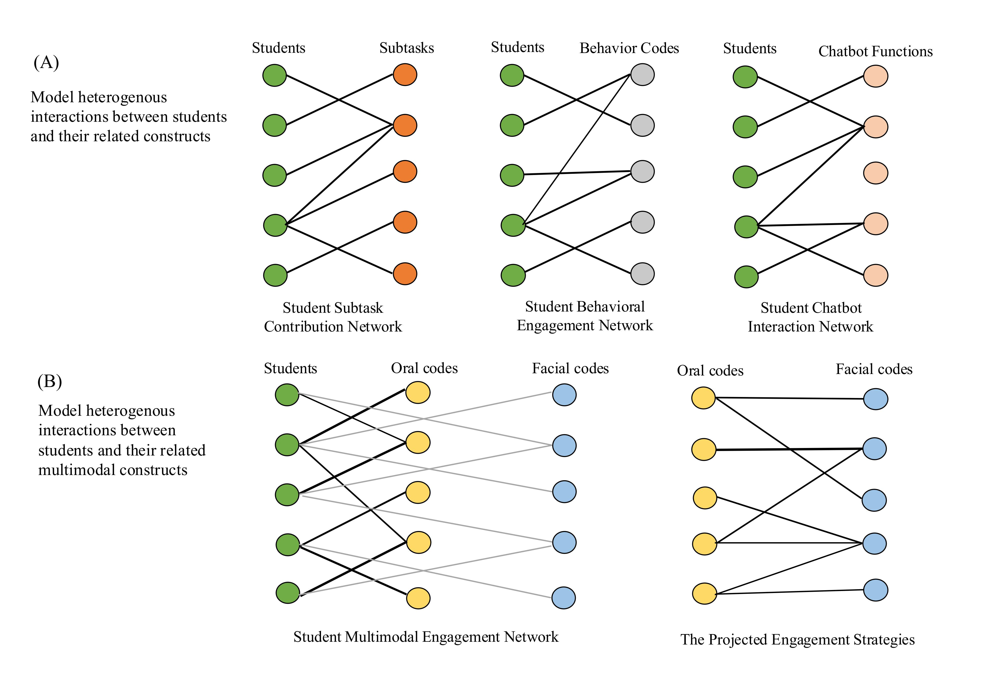

# `HINA`: A Learning Analytics Tool for `H`eterogenous `I`nteraction `N`etwork `A`nalysis in Python 

HINA is a learning analytics tool that models and analyzes heterogenous interactions in learning processes. Heterogenous interactions refer to the interactions occurring between different types of entities during learning processes, such as students’ interactions with learning objects or students’ display of different behaviors coded using multimodal process data. 

**Heterogenous interaction networks (HINs)** consist of different sets of nodes and edges connecting nodes from different sets. Each node in a heterogenous interaction network (HIN) can represent any meaningful entity reflecting a certain object or construct in a learning process, such as a student, group of students, coded behavior, or learning artefact. Edges in HINs pair nodes from different sets and can reflect affiliations, associations, or interactions among the nodes for modeling a specific learning process.

**Heterogenous interaction network analysis (HINA)** offers a flexible, adaptive, and widely applicable method to model a wide variety of interactions that can occur during the learning processes, across individual learning, group learning, and community learning. 




## Table of Contents

- [Installation](#installation)
- [Modules](#modules)
  - [hina.construction](#hina.construction)
  - [hina.individual](#hina.individual)
  - [hina.dyad](#hina.dyad)
  - [hina.mesoscale](#hina.mesoscale)
  - [hina.visualization](#hina.visualization)
  - [hina.app](#hina.app)
- [Documentation](#documentation)
- [License](#license)
- [Citation](#citation)
- [Layout](#layout)

## Installation

pip install hina

## Modules

### <a id="hina.construction">[hina.construction](https://hina.readthedocs.io/en/latest/Modules/construction.html)

- **Heterogeneous Interaction Network Construction**: Provides functions to construct Heterogeneous Interaction Networks (HINs) (see examples below) directly from input learning process data. The methods in this module are designed to handle the typical
    data format encountered for learning process data traces, supporting seamless integration with learning analytics workflows.  

### <a id="hina.individual">[hina.individual](https://hina.readthedocs.io/en/latest/Modules/individual.html)

- **Individual-level Analysis**: Provides functions to compute the node-level measures gauging the quantity and diversity
    of individuals’ connections to different learning constructs. Students’ group information and construct attributes
    can be flexibly manipulated for different applications. 

### <a id="hina.dyad">[hina.dyad](https://hina.readthedocs.io/en/latest/Modules/dyad.html)

- **Dyadic Analysis**: Provides methods to identify statistically significant edges in the heterogeneous interaction
    network relative to different null models of interaction structure, which can be specified by the user.  

### <a id="hina.mesoscale">[hina.mesoscale](https://hina.readthedocs.io/en/latest/Modules/mesoscale.html)

- **Mesoscale Clustering**: Provides methods for clustering nodes in a heterogeneous interaction network according to shared interaction structure, to automatically learn the number of clusters from heterogeneity in the interaction data to find a mesoscale representation. Utilizes a novel method based on data compression for parsimonious inference. If the input is a tripartite representation of heterogeneous interaction network, the function also returns the projected bipartite networks of the related constructs of individuals within each cluster.  

### <a id="hina.visualization">[hina.visualization](https://hina.readthedocs.io/en/latest/Modules/visualization.html)

- **Visualization**: Provides network visualization functionalities for heterogeneous interaction networks.
    Users can generate a customizable network visualization using a specified layout, allowing for the pruning of insignificant edges,
    grouping of nodes based on engagement patterns, and customization of the graph's appearance.
    Users can also visualize HINs with a novel community-based layout, emphasizing the underlying bipartite community structure.
  
### <a id="hina.app">[hina.app](https://hina.readthedocs.io/en/latest/Modules/dashboard.html)

- **HINA Dashboard**: Provides functions to deploy a dashboard that includes a web-based interface serving multiple purposes.
  
    1. The dashboard serves as a web-based tool for conducting learning analytics with HINA using an intuitive user interface,
       enabling users to conduct the individual-, dyadic- and mesoscale-level analysis available in the package without any programming.
    2. The dashboard also allows teachers and students to visualize, interpret, and communicate HINA results effectively.
    
    This dual functionality supports both data analysis and the sharing of actionable insights in an interactive and user-friendly manner,
    making it a versatile tool for both data analytics and teaching practice. 

## Documentation

Detailed documentation for each module and function is available at the link below:

### [HINA Documentation](https://hina.readthedocs.io/en/latest/)

## License 
Distributed under the MIT License. See LICENSE for more information.

## Layout
```bash

HINA/
├── __init__.py
│
├── construction/                    # Construct bipartite & tripartite networks
│   ├── __init__.py
│   ├── network_construct.py
│   └── tests/
│       ├── __init__.py
│       └── test_network_construct.py
├── individual/                      # Node-level analysis: quantity & diversity
│   ├── __init__.py
│   ├── quantity.py
│   ├── diversity.py
│   └── tests/
│       ├── __init__.py
│       └── test_quantity.py
│       └── test_diversity.py
│
├── dyad/                            # Edge-level analysis: significant edges
│   ├── __init__.py
│   ├── significant_edges.py
│   └── tests/
│       ├── __init__.py
│       └── test_significant_edges.py
│
├── mesoscale/                       # Mesoscale clustering analysis
│   ├── __init__.py
│   ├── clustering.py
│   └── tests/
│       ├── __init__.py
│       └── test_clustering.py
│
├── visualization/                   # Network visualization utilities
│   ├── __init__.py
│   ├── network_visualization.py
│   └── tests/
│       ├── __init__.py
│       └── test_network_visualization.py
│
├── app/                              # Web-based API & frontend
│   ├── __init__.py
│   ├── api/                          # Backend API logic
│   │   ├── __init__.py
│   │   ├── api.py
│   │   ├── utils.py
│   │
│   ├── tests/                        # API unit tests
│   │   ├── __init__.py
│   │   └── test_api.py
│   │
│   ├── frontend/                     # Web interface (React/TypeScript)
│       ├── src/
│           ├── components/
│           │   ├── Navbar/
│           │   │   ├── NavbarMinimalColored.tsx
│           │   ├── Webinterface/
│           │   │   ├── Webinterface.tsx
│           │
│           ├── pages/
│           │   ├── Homepage.tsx
│           │
│           ├── App.tsx
│           ├── main.tsx
│           ├── Router.tsx
│
├── utils/                            # Utility functions for graph & plotting
│   ├── __init__.py
│   ├── graph_tools.py
│   ├── plot_tools.py
│   └── tests/
│       ├── __init__.py
│       ├── test_graph_tools.py
│       └── test_plot_tools.py
│
├── data/                             # Sample datasets
│   ├── __init__.py
│   ├── synthetic_data.csv
│   └── example_dataset.xlsx


